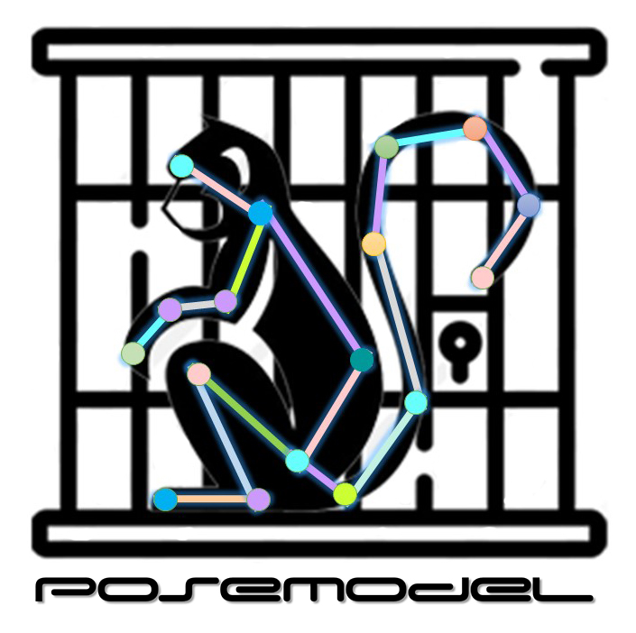
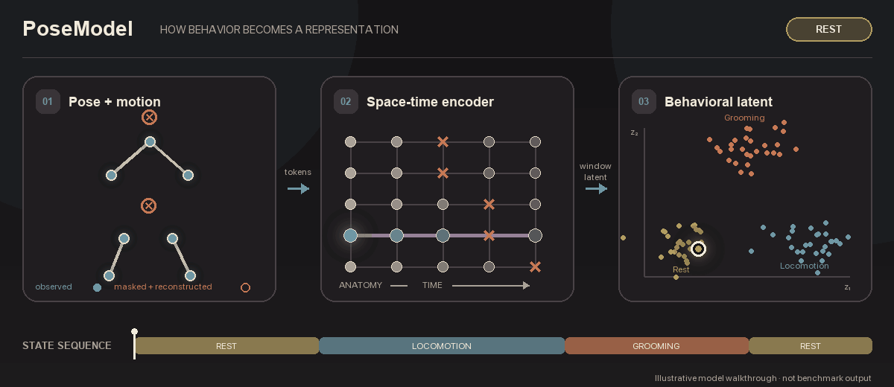
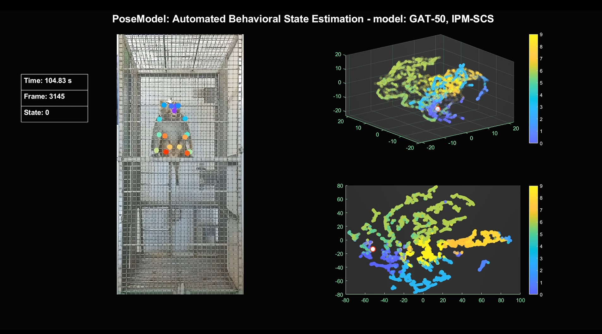
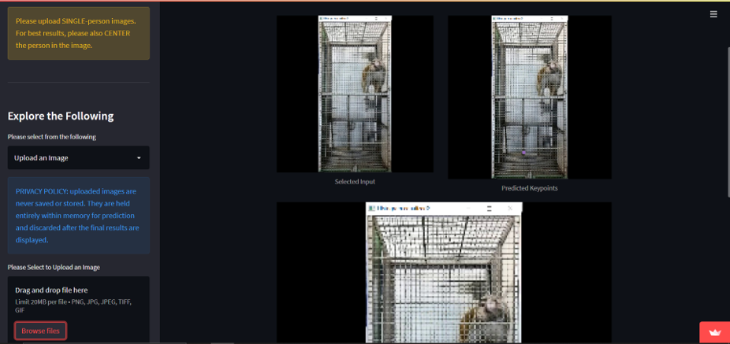

<p align="center">
  
</p>

<h1 align="center">PoseModel</h1>

<p align="center">
  <strong>From movement to meaningful behavioral representations.</strong><br>
  Self-supervised spatiotemporal graph learning for 2D and 3D pose sequences.
</p>

<p align="center">
  <a href="LICENSE"></a>
  
  
  
</p>

PoseModel learns compact behavioral embeddings directly from pose-estimation trajectories. It
combines anatomical graph attention, long-range temporal attention, confidence-aware masked
learning, and an exponential-moving-average teacher in one research-ready Python package. The
resulting embeddings can be clustered into behavioral states, evaluated with annotations, or used
as features in downstream neuroscience and ethology workflows.

> **Project status:** PoseModel is an alpha research release. The current package is a clean,
> tested rewrite; the original experimental implementation remains available in
> [`legacy/`](legacy/).

## How it works

<p align="center">
  
</p>

<p align="center"><em>
  Confidence-aware pose windows become anatomical and temporal graph tokens. Masked joints are
  reconstructed, each window is compressed into a latent representation, and neighboring
  embeddings reveal persistent behavioral states. The geometry is illustrative, not a benchmark
  result.
</em></p>

Regenerate the animation with `python scripts/make_readme_animation.py`.

## Research vision in action

<p align="center">
  
</p>

<p align="center"><em>
  Pose tracking, latent trajectories, and discovered behavioral states from the original
  PoseModel experiments. The current package turns this research workflow into a reproducible API
  and benchmark.
</em></p>

## Why PoseModel?

| Capability | What it provides |
|---|---|
| Anatomical graph modeling | Learns relationships defined by the skeleton instead of treating keypoints as an unstructured vector. |
| Long-range motion context | Models temporal structure across each behavioral window. |
| Confidence-aware learning | Preserves missingness and excludes unobserved targets from reconstruction losses. |
| Masked teacher-student objective | Learns contextual motion features from incomplete and noisy tracking data. |
| Compact window embeddings | Produces fixed-size representations for clustering, visualization, and prediction. |
| Leakage-safe benchmarking | Compares methods across held-out animals, sessions, or recordings using identical windows. |

The model factorizes spatial and temporal reasoning rather than building one enormous dense graph
for every video window. This keeps the inductive bias anatomically meaningful and the
implementation practical on CPU, CUDA, and Apple MPS.

## Install

PoseModel requires Python 3.10 or newer. For an editable development installation:

```bash
git clone https://github.com/MeysamAmirsardari/PoseModel.git
cd PoseModel
python -m pip install -e '.[dev]'
```

## Five-minute workflow

Inspect and prepare a DeepLabCut recording:

```bash
posemodel inspect path/to/recording.csv
posemodel prepare path/to/recording.csv artifacts/recording.npz --fps 30
```

Train, embed, and discover behavioral states:

```bash
posemodel train artifacts/recording.npz --config configs/base.yaml --output runs/example
posemodel embed runs/example/model.pt artifacts/recording.npz embeddings.npz
posemodel cluster embeddings.npz states.csv
```

Each checkpoint records its model configuration and skeleton topology. Each prepared sequence
carries joint names, individual identities, frame rate, confidence, observed masks, source
identity, and preprocessing provenance.

## Benchmark representations, not anecdotes

PoseModel includes a reproducible multi-recording benchmark for answering the questions that
matter: Do the embeddings predict annotated behavior? Are clusters stable? Do they generalize to
new animals? Are they robust to tracking failures?

```bash
posemodel benchmark-index \
  configs/my-benchmark.yaml \
  benchmarks/window-index.csv

posemodel benchmark \
  configs/my-benchmark.yaml \
  --output benchmarks/my-run
```

The runner evaluates PoseModel alongside kinematic, PCA, and temporal-autoencoder baselines. It can
also import aligned representations from CEBRA, Keypoint-MoSeq, or another method. Outputs include
a self-contained HTML report, machine-readable metrics, trained artifacts, and aligned embeddings.

Metrics cover frozen linear probes, k-nearest neighbors, few-shot label efficiency, cluster
agreement and stability, animal/session leakage, and robustness to missing joints and coordinate
jitter. Representation fitting and normalization use training data only.

See the [benchmark guide](docs/benchmarking.md) and
[example manifest](configs/benchmark.example.yaml) for the full protocol.

## Python API

```python
from posemodel.io import load_dlc
from posemodel.preprocessing import NormalizeConfig, normalize_pose

sequence = load_dlc("recording.csv", fps=30)
normalized, transform = normalize_pose(
    sequence,
    NormalizeConfig(confidence_threshold=0.2),
)
```

The canonical coordinate layout is
`(frames, individuals, joints, dimensions)`; confidence and observed masks use
`(frames, individuals, joints)`.

## Architecture and engineering

- Factorized spatial graph attention and temporal attention.
- Pose and motion streams with a compact window-level latent.
- Optional variational bottleneck and KL warm-up.
- Masked coordinate, velocity, bone-length, and teacher-target objectives.
- Leakage-safe window construction and deterministic evaluation seeds.
- Typed public package with unit and end-to-end tests.
- No PyTorch Geometric dependency in the core model.

Read the [architecture rationale](docs/architecture.md), review
[`CONTRIBUTING.md`](CONTRIBUTING.md), or explore the command line with `posemodel --help`.

<details>
<summary><strong>A glimpse of the original interactive prototype</strong></summary>

<br>
<p align="center">
  
</p>

This screenshot is preserved as part of the project history. The supported interface in the alpha
rewrite is the Python package and `posemodel` command-line application.

</details>

## Cite PoseModel

If PoseModel contributes to a publication, please cite the software and the exact released version
or commit used in the analysis. GitHub exposes the repository's machine-readable
[`CITATION.cff`](CITATION.cff) through its **Cite this repository** menu.

```bibtex
@software{amirsardari_posemodel_2024,
  author  = {Meysam Amirsardari},
  title   = {PoseModel: Self-Supervised Spatiotemporal Graph Representation Learning for Pose-Based Behavior},
  year    = {2024},
  version = {0.1.0},
  url     = {https://github.com/MeysamAmirsardari/PoseModel}
}
```

For archival citation, create a tagged release and connect the repository to Zenodo; then cite the
version-specific DOI produced by Zenodo instead of the moving repository URL.

## License

PoseModel is available under the [MIT License](LICENSE).
